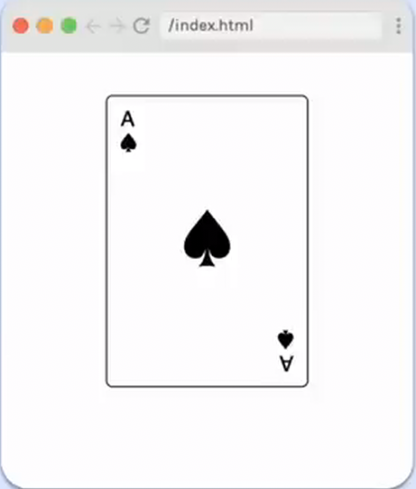

# Ace of Spades

## Requirements

- Match layout as closely as you can.
- Card width should be 2/3 its height.
- Card can be fixed size (does not need to grow and shrink with browser).

## Provided code

### HTML

    

      

        

          
A

          
&spades;

        

        
&spades;

        

          
A

          
&spades;

        

      

    

### CSS

    html,
    body {
      margin: 0;
      padding: 0;
    }

    :root {
      --card-height: 200px;
    }
