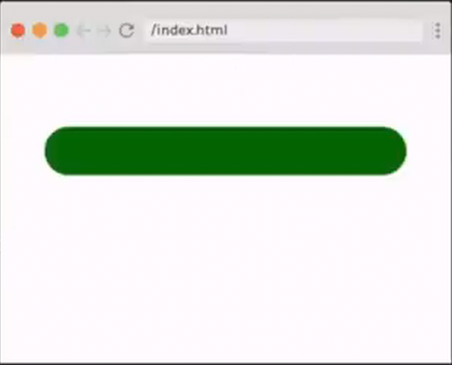

# Adjustable Progress Bar

Stage 1:

Stage 2:

Stage 3:

Stage 4:

## Requirements

Build a progress bar that you can change by swapping classes. Style a class for each of the progress bar's stages:

- Stage 1: 25% finished.
- Stage 2: 50% finished.
- Stage 3: 75% finished.
- Stage 4: 100% finished.

## Hint

It may help to think the progress bar as two elements, one on top of another: an outer progress bar and an inner progress bar. How can you use the width of the inner progress bar to create the effect of the outer progress bar filling?

## Provided code

### HTML

     

      

        

      

    

### CSS

    html,
    body {
        margin: 0;
        padding: 0;
    }

    :root {
        --stage-1: 25%;
        --stage-2: 50%;
        --stage-3: 75%;
        --stage-4: 100%;
        --progbar-bg: lightgray;
        --stage-1-bg: red;
        --stage-2-bg: orangered;
        --stage-3-bg: greenyellow;
        --stage-4-bg: green;
    }

