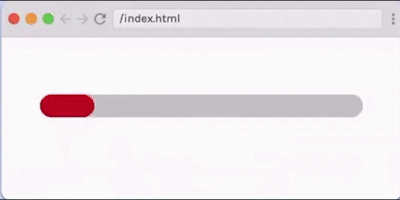

# Animate Progress Bar



## Requirements

- Build a CSS animation of a progress bar filling to 100%. the animation should run continuously, with a small pause when the bar is filled 100%.
- The progress begins red, turns blue at 50% full, and green when complete.
- CSS only!

## Hints

- It may help to think of the progress bar as two elements, one on top of another: an outer progress bar and an inner progress bar. How can you use the width of the inner progress bar to create the effect of the outer progress bar filling?
- Use the animation property and keyframes to complete this challenges. There's no way to pause an infinite animation between iterations, so to create the effect of a "pause" once the progress bar has filled to 100%, you may need an extra keyframe.

## Provided code

### HTML

````html
<div class="container">
    <div class="progress-bar">
        <div class="progress-bar progress-status"></div>
    </div>
</div>

````
### CSS
```css
html,
body {
    margin: 0;
    padding: 0;
}

:root {
    --progressbar-bg: lightgrey;
    --start: red;
    --middle: blue;
    --finish: green;
}
```