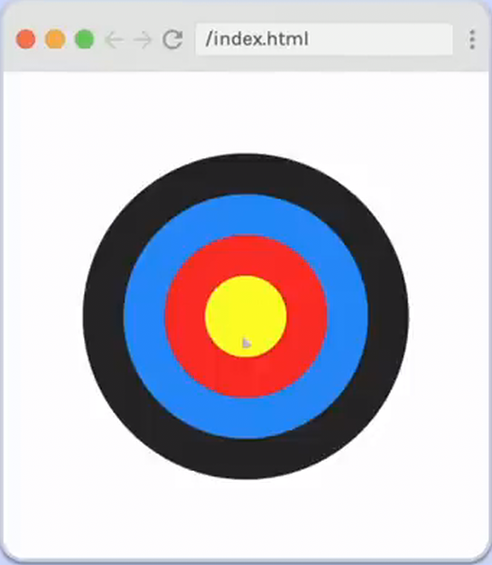

# Archery Target

## Build an Archery Target

- Match the example
- Center on the page
- No need to make responsive
- Hint:
  - These are four circles layered on top of one another, and each circle is centered within a larger circle.

## Provided code

### HTML

    

        

            

                

                    

                

            

        

    

### CSS

    :root{
      --black:#282828;
      --blue: #2892f9;
      --red: #fb2f27;
      --yellow: #fdfe29;
     }

    html,body {
       margin: 0;
       padding: 0;
     }
