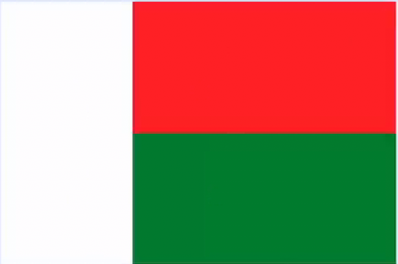

# Flag of Madagascar



## Requirements

- Aspect ratio: 2:3.
- Stripes are equal area (same height and width).

### Calculate Aspect ratio

Aspect ratio = *height* * *ratioHeight* / *ratioWidth*

#### Example

Flag ratio: **5:4**

Flag height: **200px**

```css
    .country-flag {
    width: calc(200px * 4 / 5);
}
```

## Provided code

### HTML

```html

<div class="flag-madagascar">
    <div class="white stripe"></div>
    <div>
        <div class="red stripe"></div>
        <div class="green stripe"></div>
    </div>
</div>
```

### CSS

```css
html, body {
    margin: 0;
    padding: 0;
    background: black;
}

:root {
    --white: #FFFFFF;
    --red: #FC3E32;
    --green: #007E39;
    --flag-height: 150px;
}
```