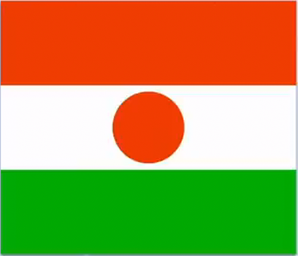

# Flag of Niger

## Requirements

- Aspect ratio: 6:7.
- Stripes have equal area.
- Circle 85% of the height of the stripe.

### Calculate Aspect ratio

Aspect ratio = *height* * *ratioHeight* / *ratioWidth*

#### Example

Flag ratio: **5:4**

Flag height: **200px**

    .country-flag{
     width:calc(200px*4/5);
    }

## Provided code

### HTML

    

        

        

          

        

        

      

### CSS

    html,
    body {
      margin: 0;
      padding: 0;
      background: black;
    }

    :root {
      --orange: #E15307;  
      --white: #FFFFFF;
      --green: #10AF2A;
      --flag-height: 200px;
    }
