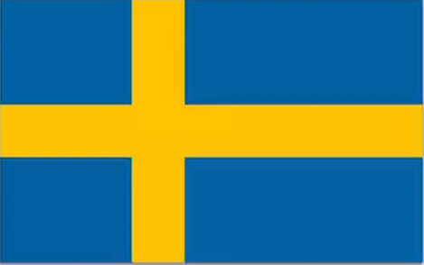
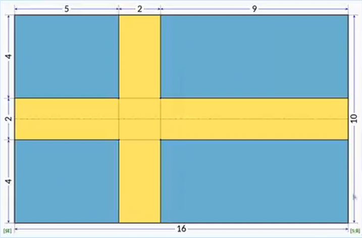

# Flag of Sweden

## Requirements

- Aspect ratio: 5:8.

### Calculate Aspect ratio

Aspect ratio = *height* * *ratioHeight* / *ratioWidth*

#### Example

Flag ratio: **5:4**

Flag height: **200px**

    .country-flag{
     width:calc(200px*4/5);
    }

## Hint

- Horizontal rectangle: 2/10 of the height and it is in the middle.

- Vertical rectangle: 2/16 of the width and it is five parts away from the edge of the flag.

## Provided code

### CSS

    html,
    body {
      margin: 0;
      padding: 0;
    }

    :root {
      --blue: #0269A6;
      --yellow: #FECC00;
      --flag-height: 150px;
    }
