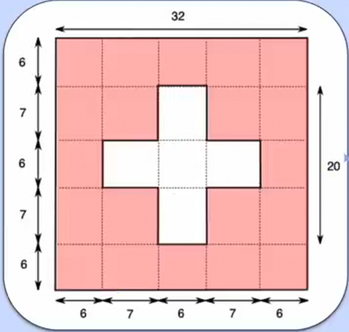

# Flag of Switzerland


## Requirements

- Aspect ratio: 1:1.

### Calculate Aspect ratio

Aspect ratio = *height* * *ratioHeight* / *ratioWidth*

#### Example

Flag ratio: **5:4**

Flag height: **200px**

```css
    .country-flag {
    width: calc(200px * 4 / 5);
}
```

## Hint



If the cross is two rectangles sitting one one top of the other, the horizontal rectangle would be 3/16 the height of
the
flag and 5/8 the width of the flag.

## Provided code

### CSS

```css
    :root {
    --white: #fff;
    --red: #FF0092;
    --flag-height: 200px;
}
```