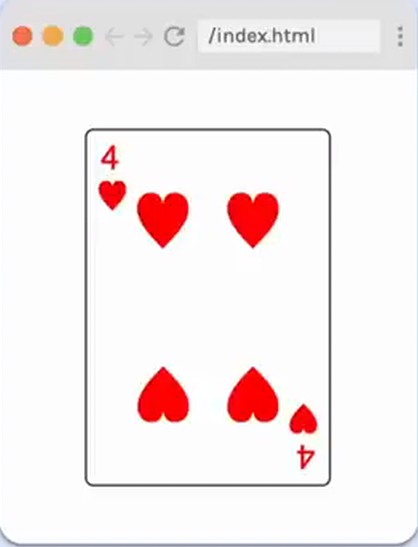

# Four of Hearts

## Requirements

- Match layout as closely as you can.
- Card width should be 2/3 its height.
- Card can be fixed size (does not need to grow and shrink with browser).

## Provided code

### HTML

    

        

            

                
4

                
&hearts;

            

            

                
&hearts;

                
&hearts;

                
&hearts;

                
&hearts;

            

            

                
4

                
&hearts;

            

        

    

### CSS

    html,
    body {
      margin: 0;
      padding: 0;
    }

    :root {
      --card-height: 200px;
    }
