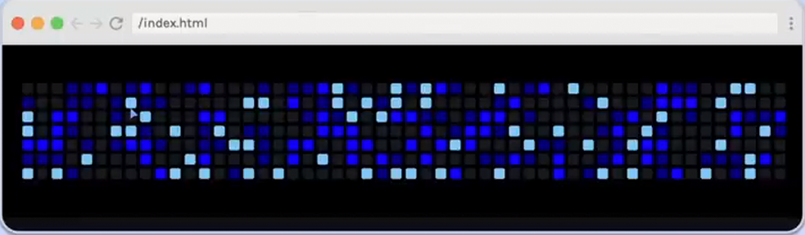

# GitHub Contributions Graph



## Requirements

- The HTML for the graph is generated by the code in index.js. You don't need to worry about how the code works (unless
  you want to!).
- The graph has 7 squares in each column, representing each day of the week, and 52 squares in each row, representing
  each week of the year.
- Style the graph whit default squares. then create selectors that will style each square based on the number of
  contributions per day. The JS code randomly each square a contribution level of 0, 3, 5, or 10, which is assigned
  using a data property. The lighter the color, the greater the number of contributions for the day.

## Hints

- This challenge is a really great candidate for CSS grid and the repeat() function.
- For styling the squares, look int using attribute selectors.

## Provided code

### HTML

```html
<div class="graph-container">
    <div class="graph"></div>
</div>
<script src="index.js"></script>
```

### CSS

```css
html,
body {
    margin: 0;
    padding: 0;
    background-color: #0d1116;
}

:root {
    --graph-bg: #000;
    --default-square-bg: #161b22;
    --level3: darkblue;
    --level5: blue;
    --level10: lightskyblue;
}
```

### JavaScript

```js
function generateRandomContributionStats() {
    const contributions = [];
    const levels = [0, 0, 0, 3, 5, 10];
    for (let i = 0; i < 52; i++) {
        const week = [];
        // make 7 squares and randomly
        for (let i = 0; i < 7; i++) {
            week.push(levels[Math.floor(Math.random() * levels.length)]);
        }
        contributions.push(week);
    }
    return contributions;
}

function makeGraph() {
    const graph = document.querySelector(".graph");
    const contributions = generateRandomContributionStats();
    for (let i = 0; i < contributions.length; i++) {
        //Create a li for each week and add to graph ul
        let graphWeek = document.createElement("ul");
        graphWeek.classList.add(`week-${i + 1}`);
        //Create a square for each contribution array, and assign a level
        contributions[i].forEach((level) => {
            let square = document.createElement("li");
            square.classList.add("square");
            square.dataset.value = level;
            graphWeek.appendChild(square);
            graph.appendChild(graphWeek);
        });
    }
}

makeGraph();
```