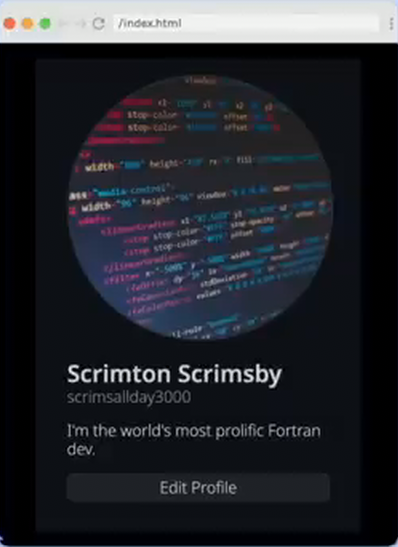
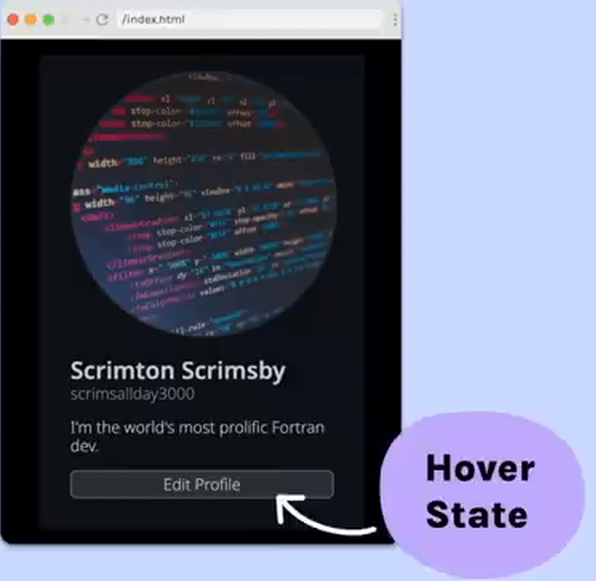

# Github Profile Layout

***Note**: Image used for this challenge is different from the one shown*.

## Requirements

- Match example as closely as you can.
- Include button hover state.
- Responsiveness:
  - Profile image is fully responsive.
  - Profile grows no larger than 400px and shrinks no smaller than 250px.

## Provided code

### HTML

    

      

        
        

          <h2>Scrimton Scrimsby</h2>
          <h3>scrimsallday3000</h3>
          
I'm the world's most prolific Fortran dev.

          <button type="button">Edit Profile</button>
        

      

    

### CSS

    html,
    body {
      margin: 0;
      padding: 0;
      background-color: #000;
      color: #c9d1d9;
    }

    :root {
      --font-main: 'Noto Sans', sans-serif;
      --main-bg: #000;
      --profile-bg: #0d1117;
      --profile-color: #c9d1d9;
      --profile-img-border: #2e343b;
      --username-font-color: #8b949e;
      --username-font-weight: 400;
      --btn-bg: #21262d;
      --btn-color: #c9d1d9;
      --btn-bg-hover: #30363d;
      --btn-border: #373b43;
      --btn-border-hover: #8c949e;
    }