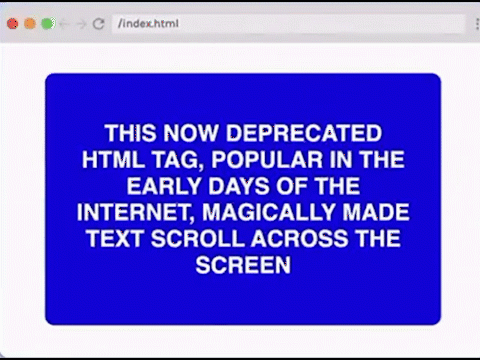

# Jeopardy Flashcard



## Requirements

- Card has two sides, and flips from front to back on hover.
- Match styles as closely as you can.
- CSS only.
- Don't worry about responsiveness.

## Hints

- A card flip is essentially an element rotating 180degress in 3D space. Use .card class to create the flip effect, then
  show and hide the front and back content as the card flips.
- Use the transition property for a smooth flip.
- The CSS properties transform-style:preserve-3d and backface-visibility will help you along the way.

## Provided code

### HTML

```html
<div class="card">
    <div class="card-front">
        <h2>
            This now deprecated HTML tag, popular in the early days of the internet, magically made text scroll across
            the screen.
        </h2>
    </div>
    <div class="card-back">
        <h2>What is the marquee tag</h2>
    </div>
</div>
```

### CSS

```css
html,
body {
    margin: 0;
    padding: 0;
    display: flex;
    justify-content: center;
}

:root {
    --jeopardy-blue: #868CE9;
    --font-color-main: #fff;
}
```