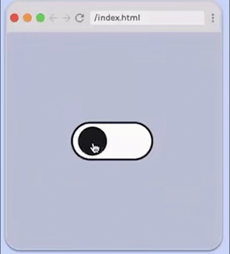

# Toggle Switch

 

## Requirements

- On click, toggle switch moves from one side to another.
- Cursor becomes a pointer
- Match styles.
- No JavaScript!

## Hints and Help

- if you hide the checkbox, you'll still be able to style and toggle back and forth between **input:checked** adn **input:unchecked** pseudo classes by clicking on the checkbox label.
- Use a sibling selector to style the **.toggle-switch** class when the input is :checked  or :unchecked.

## Provided code

### HTML

        

        <label for="toggle">
           <input type="checkbox" id="toggle" class="toggle-input"></input>
           

</label>
    

