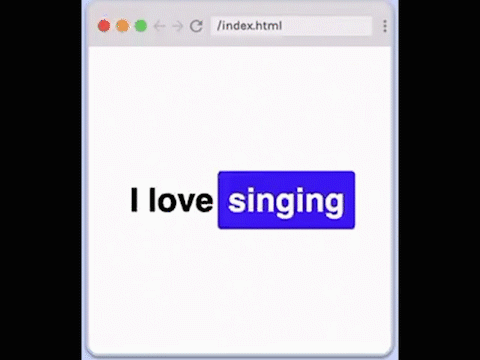

# Word Carousel

## Requirements

- Match styles
- Personalize-display 4 things you love.
- Words should rotate in an infinite loop.
- No JavaScript.

## Hints

- You can define the steps of an animation in keyframes using percentages, with 0% being the beginning of the animation and 100% being the end of the animation!
- Think about how you can use a pseudo element's **content** property to swap words.
